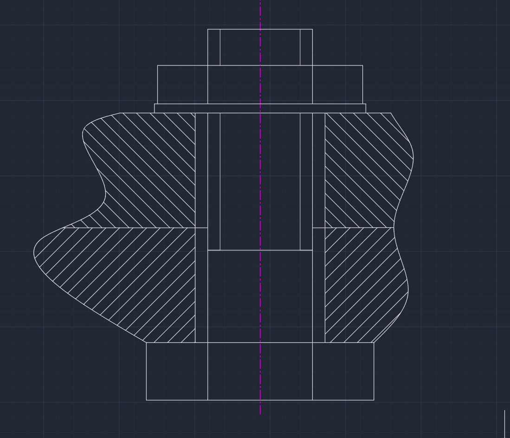
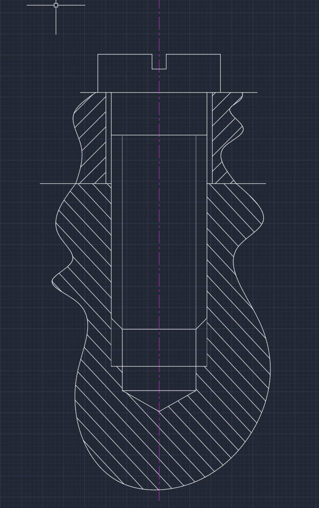

[[Engineering Graphics]]
# 1. 螺纹的五要素
## 1. 牙形
分为粗牙与细牙。==需要注意这个与螺纹的标注是有关系的（有没有x2之类）==
==牙顶==就是我们可以摸得到的部分，牙底相反。
## 2. 公称直径
意思就是螺纹的大径的尺寸，无论是内螺纹还是外螺纹都是更大的那一个==直径==
需要注意的是，还有一个叫做“中径“的概念，意思是在牙型上沟槽和凸起宽度相等的地方的直径。
## 3. 线数n（注意其与螺距导程的关系）
螺旋线的条数，注意这个也与后续的尺寸标注有关系
## 4. 螺距与导程
==螺距==就是相邻的两牙之间的距离，他们==不一定要在同一条螺旋线上== 
==导程==是在同一螺旋线上相邻两牙之间的距离
## 5.旋向
就是旋进去所需要的方向->右手螺旋就是右旋，左手螺旋就是左旋
# 2. 螺纹的规定画法
## 1. 内外螺纹的规定画法
### 1. 外螺纹
==非圆视图中==倒角的部分一定要画出来 大径要画成粗实线
注意牙底部分要画到底，不能仅仅画到倒角的部分，但是请注意这是细实线。
在==圆试图==中要注意，倒角圆不用画！但是小径是要画的，只用细实线画3/4个圆即可。

### 2. 内螺纹
小径大径的粗细实线相反，只要注意螺纹终止线要画成==粗实线== 
注意，这里的剖面符号要==画到粗实线==部分，也就是说在大径到小径之间是有剖面符号的。

### 3. 内外螺纹的相接
***==非常重要！！！==*** 
重叠的部分以外螺纹为准。
粗实线与细实线分别对齐即可。

# 3. 常用螺纹的标注 ***非常重要！！***
## 1. 普通螺纹
特征代号是M，后面直接跟数字。
比如说$M24$ 与$M24 × 2$ 这里我们一定要注意，只要是后面有==“×数字”==这个格式的，就是==细牙==螺纹，如果没有那么就是==粗牙==螺纹。后面×的数字就是螺距，因为细牙螺纹有许多种标准，所以要再次注明。
螺纹标记例如说$M14×1-7H-L-LH$的意思就是大径为14，螺距为1（细牙），公差带代号为7H， LH为左旋（==若是右旋则可以省略==）
## 2. 管螺纹
这是采用英寸制的，==若是$55°非密封$ 的==，则尺寸代号为$G$ 若是$55°密封$的，那么根据圆柱内管螺纹，圆锥内管螺纹与圆锥外管螺纹分别是$R_p, R_c, R$ 如果是==左旋==，那么应该加注LH。
尺寸代号应该直接在后面进行注明。
## 3. 梯形螺纹
### 1. 特征代号
$Tr$ 就是特征代号，如果是单线，那么直接标注，与普通螺纹相同。但是如果是多线，那么要标注成$Tr40×14(P7)LH$ P后的数字是螺距（$Pitch$）那么显然此时的线数为2
==前大后小== ->前面标注导程，后面标注螺距。

## 4. 锯齿形螺纹
特征代号为B， 标注格式与梯形螺纹是相同的。

# 4. 螺纹紧固件

## 1. 螺栓（与螺母，垫圈）
***注意点如下***
1. 上下两种材料的剖面符号应该要不一样。
2. 螺栓必须要比孔要小一点。
3. 两种材料之间的交线应该延长到与螺柱相交。
4. ***顶视图***应该要遵循***内螺纹***的画法（3/4圆， 不画倒角圆）。

注意这里的几个重点处理：
1. 不同材料交界线的延长
2. 螺纹起始线在下面
3. 上面的螺栓部分不用画虚线
4. 注意粗实线与细实线的作用
## 2. 螺柱连接
***注意点如下***
1. 分界面一定要对齐（螺纹结束线与两材料之间的分界线）
2. 要注意孔中的内螺纹也有螺纹的，而且他的结束的地方在更下面。
3. 注意上面的材料和下面的材料的孔径不一样，上面的应该是有空隙的，而下面的是紧密连接的。
4. 螺柱是中间的一小段没有螺纹，上下都有螺纹。
5. 上面的孔是光孔，下面的孔是螺纹孔。
6. ***始终注意！剖面线应该延长到粗实线的地方，而不是细实线的地方。***

7. 要一直注意各种旋转体造成的平面投影是一条线！！不能忘！例如这里的下面的内螺纹与外螺纹倒角圆积聚而成的线。
8. 注意在下面的部分，有两级结构，螺柱的长度没有内螺纹的长度长，内螺纹的长度没有原先钻孔的长度长。

## 3. 螺钉连接
### 1. 连接螺钉
1. 多用于不经常拆卸且受力不大的连接场合。多用于连接薄板与厚板。
2. 注意在圆视图（俯视图）中，我们要把顶上的那条线画成是斜的，不能与两条中心线重合，来表达这个槽的基本特征。
3. 同样要注意剖面线要碰到粗实线才会停止。
4. 与螺柱相同，下半部分应该是要紧贴外部的材料的，但是螺纹分界线可以更靠上，不用和螺柱连接一样上下对齐。

5. 请注意各类交界圆的地方都要用粗实线！
6. 注意孔上下不一定粗！
### 2. 紧定螺钉
1. 注意紧定螺钉的直径可以比孔的直径要更大一些，意思就是紧定螺钉头部的圆锥部分可以与螺孔的终止位置相接
2. 锥顶角是90°。

3. 请注意图形中的圆锥孔的直径比紧定螺钉的直径要小哦！

